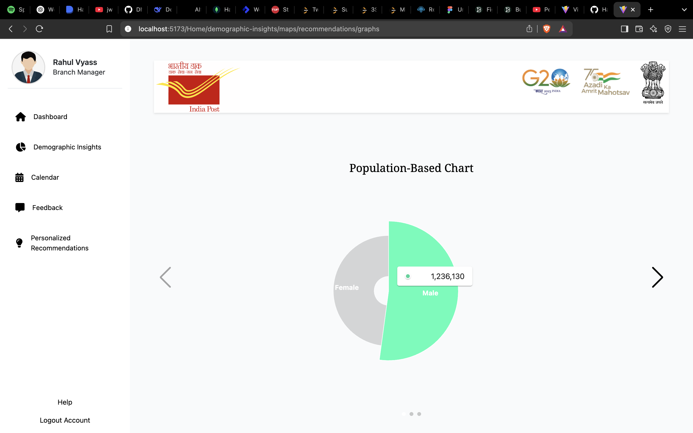

# 📬 PostYojna AI

**PostYojna AI** is a web-based, AI-driven platform developed for **India Post** to enhance the delivery and outreach of financial and insurance services. It leverages demographic and economic data to recommend suitable schemes, schedule outreach events efficiently, and visualize area-specific needs through dynamic dashboards.

## 🌟 Key Features

- 🤖 **AI-powered Scheme Recommendations**  
  Suggests suitable government schemes based on local demographic and economic patterns.

- 📊 **Visual Analytics Dashboard**  
  Interactive charts and graphs to monitor population and economic trends for better decision-making.

- 🗓 **Optimized Outreach Scheduling**  
  Recommends the best time for organizing melas based on seasonal and regional data insights.

- 🎙 **Voice-Based Feedback Analysis (NLP)**  
  Uses Natural Language Processing to analyze feedback from events, enabling continuous service improvement.
    
  
  

  
  

  
  

  
  

  

  
